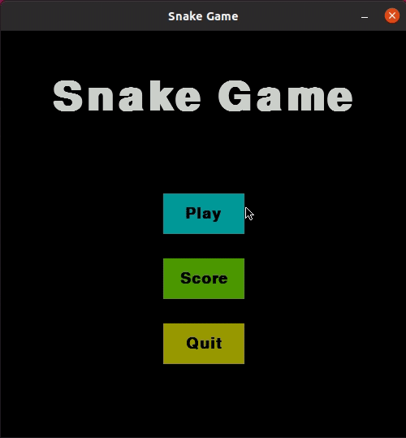

# Snake

Implemented with python and pygame.

### Demonstration



### How to run

Replace the first line of ```main.py``` file for yours python3 interpreter.

```bash
./main.py
```

### Landmarks of this game

It was my first game implemented with pygame, all the things that i learned here was important!

#### Drawing things

It was very special when i learned to draw things in the screen and understand that the "movement" of the snake is just an illusion, actually it's just shapes being drawing in a very fast velocity.

#### Score option

Score option show the top 5 players with the best score. They're implemented using the ```sqlite3``` module.

### Snake, board, music and sound effects

1) I got the idea of the snake and the board from ```Tech with tim``` [blog](https://techwithtim.net/) and [youtube](https://www.youtube.com/techwithtim) channel.
2) And music and sound effects from [this](https://opengameart.org/) site.