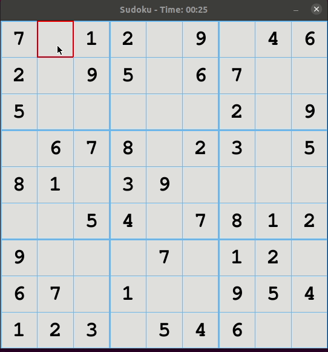

# Sudoku

Implemented with python and pygame.

### Demonstration



### How to run

Replace the first line of ```main.py``` file for yours python3 interpreter.

```bash
./main.py
```

### Landmarks of this game

#### Sudoku solver

If you press the space bar, the game will solver by itself. It's done by a Backtracking Algorithm, that you can read about [here](https://www.geeksforgeeks.org/sudoku-backtracking-7/)

#### Drawing things

I think that projects like this one, that you need to think with all the details of colors, draw a grid, block size and things like that are very good ones, and all this kind of knowledge was good.