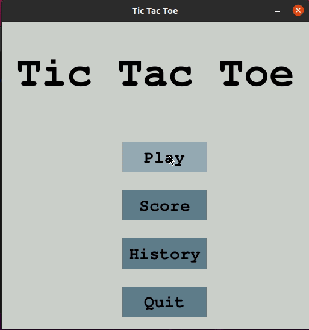

# Tic Tac Toe

Implemented with python and pygame.

### Demonstration



### How to run

Replace the first line of ```main.py``` file for yours python3 interpreter.

```bash
./main.py
```

### Landmarks of this game

#### CPU Hard 

The CPU Hard option is an "IA" implemented with Minimax Algorithm. It's just an algorithm that choose the best option, so it's unbeatble, because it will never choose to lose the game. You can read about it [here](https://www.geeksforgeeks.org/minimax-algorithm-in-game-theory-set-1-introduction/).

#### History and score

History and score are options that show the last 5 games played and top 5 players with the best scores. They're implemented using the ```sqlite3``` module.

#### Online

The online option is not implemented YET! It's a future thing that i want to do.

### Music and images

1) I got the images from [this](https://www.geeksforgeeks.org/tic-tac-toe-gui-in-python-using-pygame/) site.

2) And the music from [this](https://opengameart.org/) one.